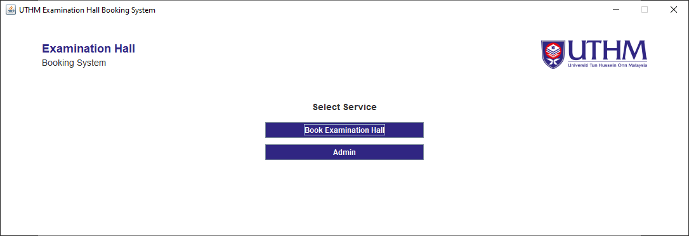
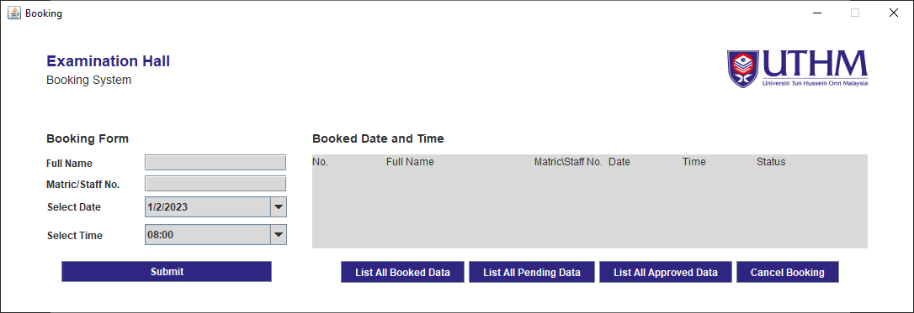
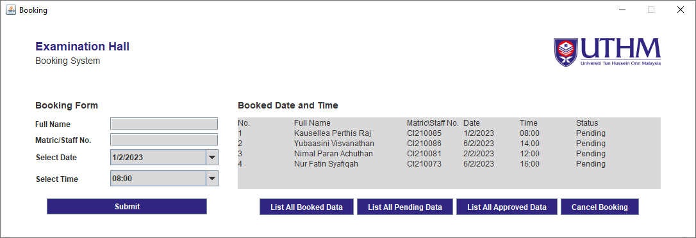
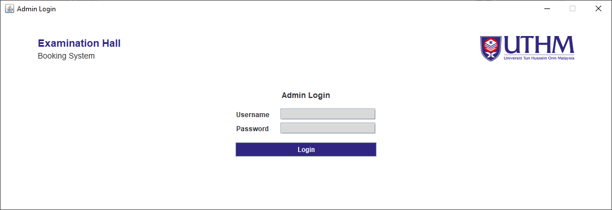
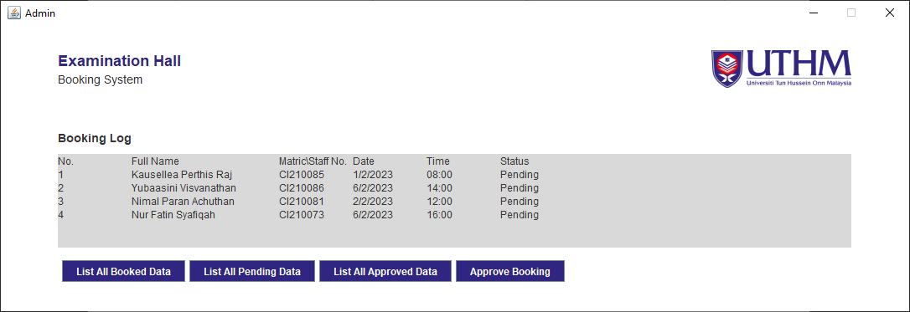
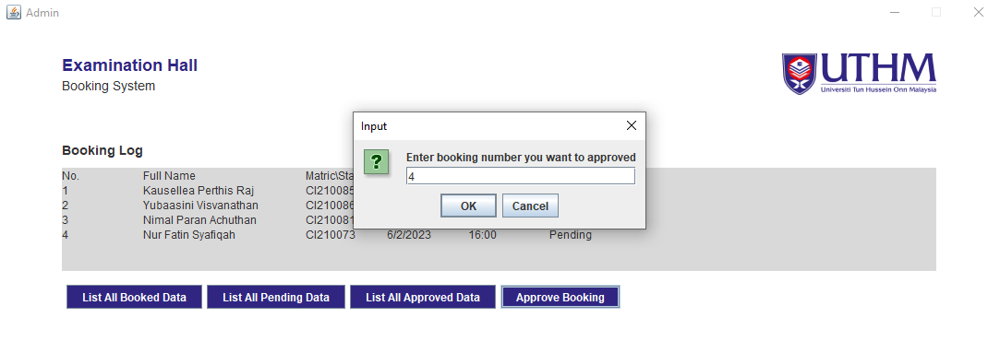
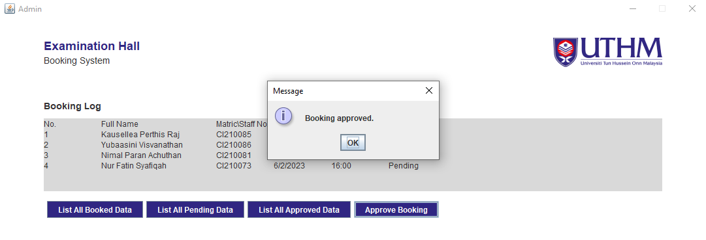

## UTHM Examination Hall Booking System

## Welcome! 👋

UTHM examination hall booking system for project assessment of object-oriented programming.

## Admin Login Credentials 🔒

| Type     | Details    |
| -------- | ---------- |
| Username | admin      |
| Password | admin12345 |

## To Run The System 🔥

1. Go to the project folder:

   - cd {based-on-your-pc-path}\oop-project
   - Example: cd D:\Projects\Java\oop-project
   - The path is based on your computer file structure

2. Compile the .java file:

   - javac -d classes -sourcepath src -cp classes src/data/Booked.java
   - javac -d classes -sourcepath src -cp classes src/data/BookedData.java
   - javac -d classes -sourcepath src -cp classes src/main/Booking.java
   - javac -d classes -sourcepath src -cp classes src/main/Admin.java
   - javac -d classes -sourcepath src -cp classes src/main/Login.java
   - javac -d classes -sourcepath src -cp classes src/main/Home.java
   - javac -d classes -sourcepath src -cp classes src/main/Main.java

3. Run the Main.class file:
   - java -cp classes main.Main
